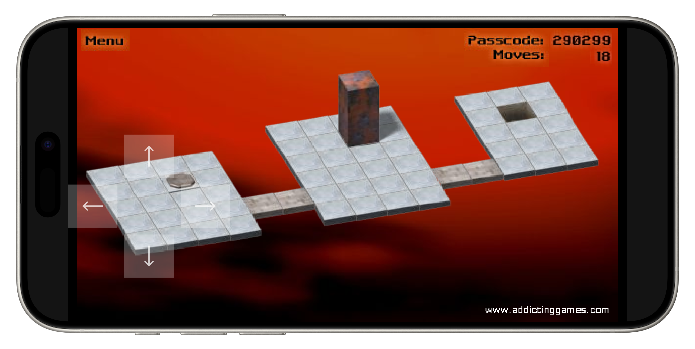

# [Luxa](https://luxa.thatstel.la)

Easier and more accessible Flash media.

## Usage

If you're just looking to experience Luxa, visit [luxa.thatstel.la](https://luxa.thatstel.la). For development or testing, see [Usage.md](Usage.md)

## Features

- Dynamically loads content with JavaScript, no individual discrete files for different media
- Dynamic device support, so media looks good on phones and desktops alike
- Full dark mode support and safe area awareness on devices that support it
- Fullscreen support with a fallback for devices that don't allow normal fullscreen
- Basic on-screen controls for touch devices or other devices without a keyboard

### Third Party Resources

- [Ruffle](https://ruffle.rs/)

---
With 💜 from Stella 